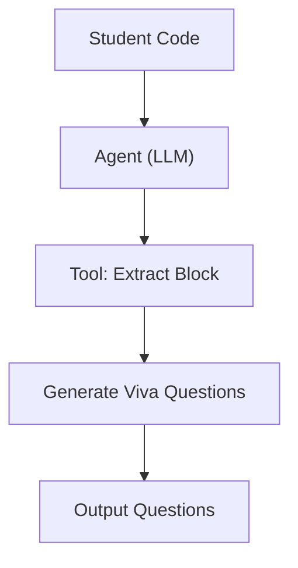
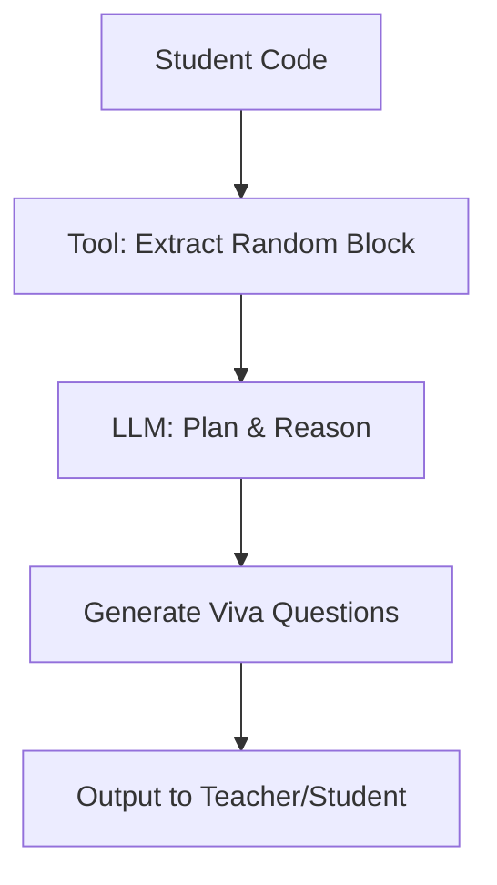

# 🌟 Basic Tutorial on Agentic AI (with CrewAI Lab Assistant)  
---

## 1. What is Agentic AI?  
Agentic AI systems don’t just answer queries — they can **reason, plan, and act**.  
Think of it as giving the AI a **mission** instead of a **question**.  

**Example in our Project (Lab Assistant):**  
We’ll build an agent that generates **viva questions** from student-submitted code.  

- **Traditional AI:** An LLM will generate questions based on its training knowledge related to the code. However it will not be able to determine other details such as   
- **Agentic AI:** Our agent will:  
   1. **Extract a logical block** from the code (tool).  
   2. **Plan** how to generate viva-style questions.  
   3. **Execute** using the LLM as the brain.  



---

## 2. The Core Components

### 🧠 Brain → LLM (Reasoning & Planning)

The **LLM is the brain** of the agent. It does reasoning and planning.

In our Lab Assistant, we connect CrewAI to a **locally running model (Ollama + Mistral)**.

```python
from crewai import LLM

llm = LLM(
    model="ollama/mistral",
    base_url="http://localhost:11434"
)
```

* Here, the **brain** is Mistral, a lightweight LLM.
* It won’t just output text — it will **decide how to achieve the task** (e.g., generate good viva questions).

---

### 🛠️ Tools → Functions for Execution

Tools = predefined functions the agent can call.

In our Lab Assistant, we need a tool to **extract a random logical block of code** from the student’s submission.

```python
from crewai.tools import tool
import re, random

@tool
def extract_random_block(code: str, max_lines: int = 8) -> str:
    """Extract a logical code block (function, loop, conditional, class)."""
    lines = code.splitlines()
    blocks = []
    n = len(lines)
    block_starts = re.compile(r"\b(def |function |class |if |for |while |switch )")

    i = 0
    while i < n:
        line = lines[i].strip()
        if block_starts.search(line):
            block = [lines[i]]
            j = i + 1
            while j < n and len(block) < max_lines:
                block.append(lines[j])
                if re.match(r"^\s*[\}\)]", lines[j]):
                    break
                j += 1
            if 3 <= len(block) <= max_lines:
                blocks.append("\n".join(block))
        i += 1

    if blocks:
        return random.choice(blocks)

    start = random.randint(0, max(0, n-3))
    end = min(n, start + random.randint(3, max_lines))
    return "\n".join(lines[start:end])
```

👉 This tool gives the agent a **focused snippet of code** to work on.

---

### 🔗 How Does the LLM Call a Tool?

Two approaches exist in general:

1. **JSON-based tool calls** → LLM outputs `{ "tool": "...", "arguments": { ... } }`.
2. **Code-based tool calls** → LLM generates code that directly calls tools.

✅ **CrewAI hides this complexity** — it lets you register tools and the agent can directly use them.

---

### ⚡ Actions → Outcomes

The **action** here = Viva questions generated for the selected block of code.

---

## 3. Putting It Together with CrewAI

Now let’s define the **Agent** and the **Task**.

```python
from crewai import Agent, Task, Crew

# Define the Agent
viva_agent = Agent(
    role="Viva Question Generator",
    goal="Generate viva-style questions from student code snippets",
    tools=[extract_random_block],
    llm=llm
)

# Define the Task
task = Task(
    description="Given a student's code, extract a random block and generate 3 viva questions.",
    agent=viva_agent
)

# Create a Crew and run
crew = Crew(agents=[viva_agent], tasks=[task])

student_code = """
def factorial(n):
    if n == 0:
        return 1
    else:
        return n * factorial(n-1)
"""

result = crew.kickoff(inputs={"code": student_code})
print("📌 Viva Questions:")
print(result)
```

✅ **Expected Output:**

```
📌 Viva Questions:
1. Can you explain how recursion works in this function?  
2. What is the base case in the factorial function?  
3. How would you modify this code to handle negative inputs?
```

---

## 4. Step-by-Step Flow

Here’s how our Lab Assistant agent processes input:



---

## 5. Summary

We’ve built a simple **Agentic AI Lab Assistant**:

* **Brain (LLM)** → Mistral via Ollama.
* **Tool** → Extract random code block.
* **Task** → Generate viva-style questions.
* **Action** → Output meaningful questions.

👉 Formula:
**Agent = Brain (LLM) + Reasoning/Planning + Tools + Actions**

---

⚡ **Next Step:** Extend the Lab Assistant by:

* Adding a tool to detect **errors in code**.
* Generating viva questions around debugging.
* Building a multi-agent setup (e.g., *Code Analyzer* + *Question Generator*).


---

✅ Now your tutorial is **interleaved** with the Lab Assistant project: every theory point is demonstrated with **actual CrewAI code** from your notebook.  

Do you want me to also generate a **Python script to draw the flowcharts (with graphviz/matplotlib)** so you can include images instead of mermaid diagrams in Jupyter?
```
